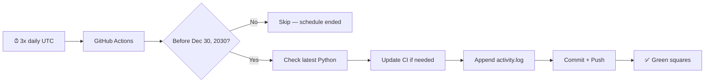

# Daily Git Commit

<p align="center">
  <a href="https://github.com/abhipattnaik/daily-git-commit/actions/workflows/daily-commit.yml">
    
  </a>
  
  
  
  
</p>

<p align="center">
  <strong>Commits to GitHub automatically — 3 times per day, no Mac required.</strong><br>
  Python app + GitHub Actions + optional local macOS scheduler.
</p>

<p align="center">
  <a href="https://github.com/abhipattnaik/daily-git-commit/actions/workflows/daily-commit.yml">
    <b>▶ Run workflow now</b>
  </a>
  &nbsp;·&nbsp;
  <a href="https://github.com/abhipattnaik/daily-git-commit/commits/main">View commits</a>
  &nbsp;·&nbsp;
  <a href="https://github.com/abhipattnaik/daily-git-commit/blob/main/logs/activity.log">Activity log</a>
</p>

---

## Jump to

| | | |
|:---:|:---:|:---:|
| [How it works](#how-it-works) | [Quick start](#quick-start) | [Commands](#commands) |
| [Setup guide](#setup-guide) | [Customize](#customize) | [FAQ](#faq) |

---

## How it works



<details>
<summary><b>Step-by-step breakdown</b></summary>

1. **GitHub Actions** triggers **3 times per day** at **08:00, 14:00, and 20:00 IST** (02:30, 08:30, 14:30 UTC) or when you click **Run workflow**.
2. **Python version check** — fetches the latest stable Python and updates workflow config if needed.
3. **Daily log** — appends a timestamped line to `logs/activity.log`.
4. **Commit & push** — creates a commit and pushes to `main`.
5. **Stops automatically** after **December 30, 2030**.

</details>

---

## Quick start

> **Requirements:** Python 3.10+ · Git · No `pip install` needed

```bash
git clone git@github.com:abhipattnaik/daily-git-commit.git
cd daily-git-commit
python3 -m daily_commit setup    # interactive setup
python3 -m daily_commit run      # commit + push right now
```

<details>
<summary><b>What does <code>setup</code> ask you?</b></summary>

- Your GitHub username
- Repository name (default: `daily-git-commit`)
- SSH or HTTPS remote URL
- Whether to push immediately

</details>

---

## Commands

| Command | What it does | When to use |
|---------|--------------|-------------|
| `python3 -m daily_commit run` | Commit **and** push | Daily test / local runs |
| `python3 -m daily_commit commit` | Commit only | Debug without pushing |
| `python3 -m daily_commit setup` | Interactive setup | First time only |
| `python3 -m daily_commit install-local` | macOS scheduler | Backup to cloud CI |
| `python3 -m daily_commit ci` | Full CI pipeline | Used by GitHub Actions |

<details>
<summary><b>Example output</b></summary>

```text
Python version up to date (3.14). Latest available: 3.14.
[main abc1234] chore: daily commit #12 on 2026-06-16T12:00:01Z
Pushed to GitHub.
```

</details>

---

## Setup guide

<details open>
<summary><b>1 · Create an empty GitHub repo</b></summary>

1. Go to [github.com/new](https://github.com/new)
2. Name it `daily-git-commit` (or anything you like)
3. **Do not** add README, license, or `.gitignore`

</details>

<details>
<summary><b>2 · Push this project</b></summary>

```bash
git remote add origin git@github.com:YOUR_USERNAME/daily-git-commit.git
git add .
git commit -m "chore: initial setup for daily commits"
git push -u origin main
```

</details>

<details>
<summary><b>3 · Verify GitHub Actions</b></summary>

1. Open your repo → **Actions** tab
2. Confirm **Daily Commit** workflow appears
3. Click **Run workflow** → branch `main` → **Run workflow**

</details>

<details>
<summary><b>4 · Optional: local macOS scheduler</b></summary>

Runs from your Mac as a backup if GitHub Actions is delayed:

```bash
python3 -m daily_commit install-local
```

You'll be asked what time to run daily (local time). Logs go to `logs/scheduler.log`.

**Uninstall:**
```bash
launchctl bootout gui/$(id -u)/com.dailygitcommit.scheduler
rm ~/Library/LaunchAgents/com.dailygitcommit.scheduler.plist
```

</details>

---

## Customize

| What you want | File to edit |
|---------------|--------------|
| Commit time (UTC) | `.github/workflows/daily-commit.yml` → `cron` |
| Schedule end date | `daily_commit/commit.py` → `SCHEDULE_END_DATE` |
| Python auto-update logic | `daily_commit/python_version.py` |
| Commit message format | `daily_commit/commit.py` |
| What file gets updated | `daily_commit/commit.py` → `LOG_FILE` |

<details>
<summary><b>Change the run schedule</b></summary>

Edit the `cron` lines in `.github/workflows/daily-commit.yml`:

```yaml
- cron: "30 2 * * *"   # 08:00 IST
- cron: "30 8 * * *"   # 14:00 IST
- cron: "30 14 * * *"  # 20:00 IST
```

Use [crontab.guru](https://crontab.guru/) to build your schedule.

</details>

<details>
<summary><b>Extend the schedule past 2030</b></summary>

In `daily_commit/commit.py`:

```python
SCHEDULE_END_DATE = date(2035, 12, 31)  # change as needed
```

</details>

---

## Live config

| Setting | Current value |
|---------|---------------|
| CI Python version | `3.14` ([config](config/python-version.json)) |
| Schedule | 3× daily at 08:00, 14:00, 20:00 IST |
| Active until | December 30, 2030 |
| Log file | `logs/activity.log` |
| Auth | Built-in `GITHUB_TOKEN` (no PAT needed) |

---

## FAQ

<details>
<summary><b>Will this keep my GitHub streak green?</b></summary>

Yes — as long as the workflow runs successfully each day, you'll get a commit on your contribution graph.

</details>

<details>
<summary><b>Do I need to keep my Mac on?</b></summary>

No. GitHub Actions runs in the cloud. The local scheduler is optional.

</details>

<details>
<summary><b>Why did I see a Node.js deprecation warning?</b></summary>

That was a GitHub Actions notice, not a failure. This project uses `actions/checkout@v6` and `actions/setup-python@v6` (Node.js 24 compatible). Always use **Run workflow** (fresh run), not **Re-run jobs** on an old run.

</details>

<details>
<summary><b>Workflow didn't run on schedule?</b></summary>

- Scheduled runs can be delayed a few minutes during high GitHub load
- Free accounts need repo activity in the last 60 days for schedules to stay active
- Check **Actions** tab for failed runs

</details>

---

<p align="center">
  <sub>Built with Python · Powered by GitHub Actions · <a href="https://github.com/abhipattnaik/daily-git-commit">abhipattnaik/daily-git-commit</a></sub>
</p>